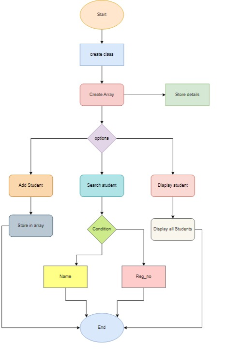

Question 

Create a student class, that will store the details of the Student
Reg. No.
Name
Email
Phone
Class
Department
The class will have a constructor to initialize the values of the Student and a method to print the Details of the Student.

In the main-method class, create an array of Student Class to hold maximum details of 100 Students.
In the menu-driven program, the menu options will have
Add a student
Adds the details of 1 student to the array of Student
Search for a student
Search for the details of a student from the array of Student
(Optional) Searching can be done with Name & Register Number
Display all students
Displays the details of all students

***************************************************

->First create a Student class
->Then take the required conditions with the suitable data types.
->and then ask the user to enter all the details of the student.
->The details should be Reg_no, Name,class,email,phone numder,department.
->after taking the details of the there it should ask for a choice option.like add the student ,search for student either with name or reg_no,display all students ,exit.
->for all the we will create a seperate user-define function Or we can also use a if & if else functions.
->use should ask user to select the option like if they want ot add the student details or they want to search for student or to display the student.
->Here we used the switch case for taking the choice form user 
->In case:1 we have the add student function
  ->that have reg_no ,name,class,department,phone number,email and it will only take when it have the length 100 only other wise it will show error.
  ->and in case:2 we have search for the student by name or reg_no.
  ->in case;3 we will display all the students that we addes in the arrya
  ->case:4 exiting from the program.
  
  
  
  FLOW CHART:

